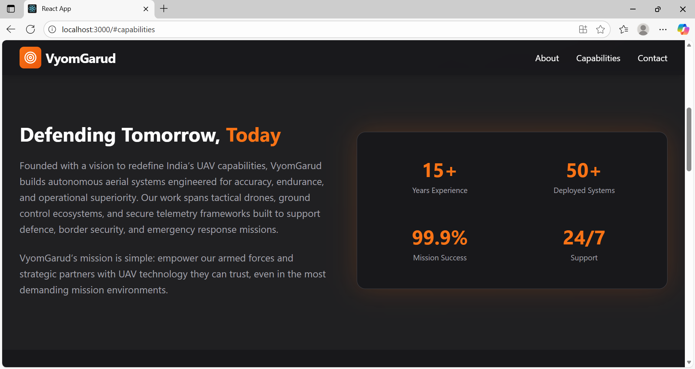
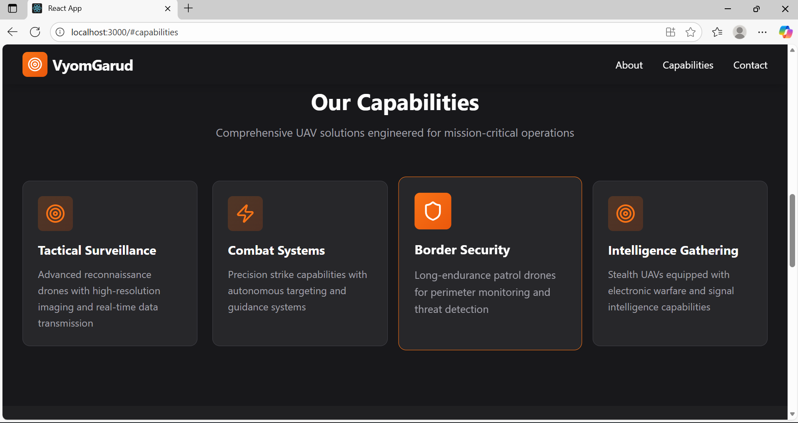
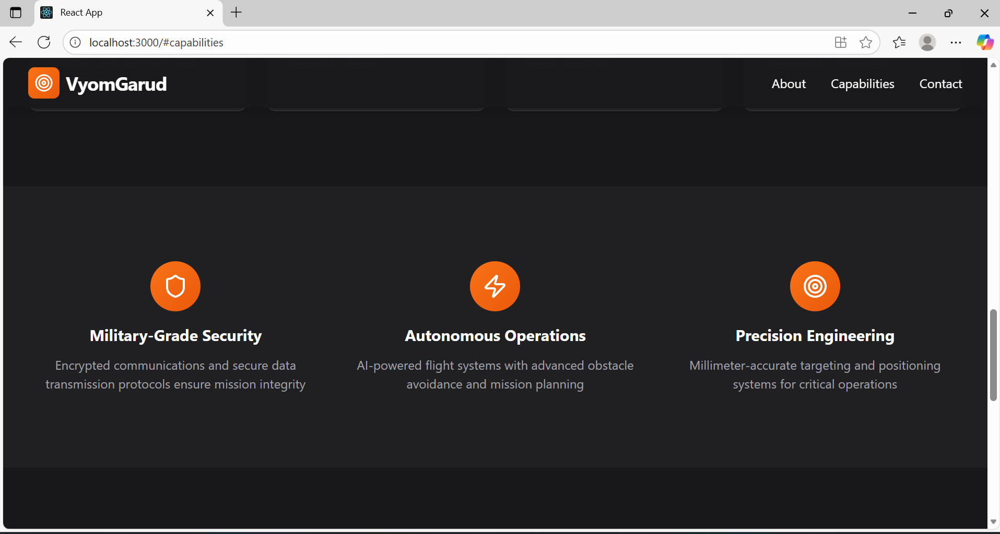
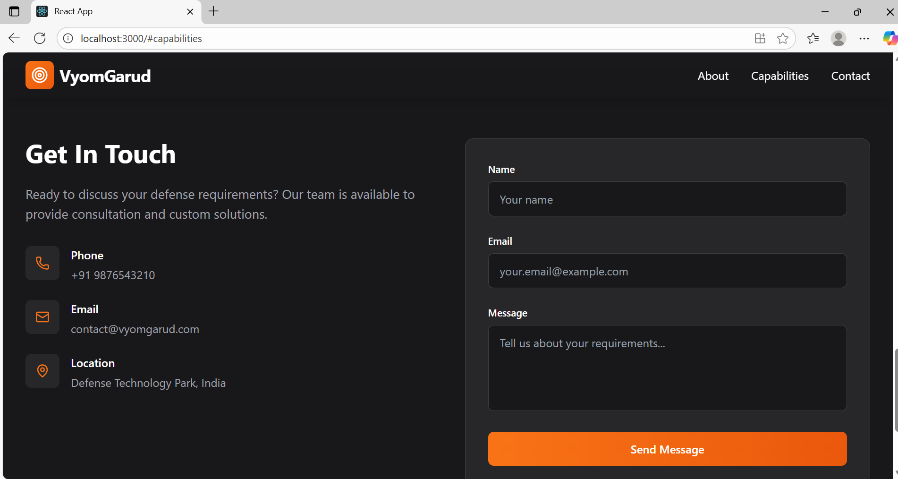

# VyomGarud Landing Page

A modern and responsive landing page created for the VyomGarud Web Developer Internship assessment.

---

## Overview

This project is a single-page landing website built using React and Tailwind CSS.
It presents information about VyomGarud, a UAV and defence tech company, including the hero section, about section, capabilities, highlights, and a contact form.

---

## Features

* Responsive layout suitable for mobile, tablet, and desktop
* Dark military-style user interface
* Orange highlight accents
* Mobile navigation with menu toggle
* Animated hero background
* Capability cards with hover effects
* Contact form with basic form handling

---

## Tech Stack

* React (Create React App)
* Tailwind CSS
* Lucide React Icons

---

## Project Structure

```
vyomgarud-landing/
│
├── node_modules/
├── public/
│   └── index.html
│
├── src/
│   ├── App.js
│   ├── App.css
│   ├── index.js
│   ├── index.css
│   ├── logo.svg
│   ├── reportWebVitals.js
│   └── setupTests.js
│
├── package.json
├── package-lock.json
├── tailwind.config.js
├── postcss.config.js
├── .gitignore
└── README.md
```

---

## Setup Instructions

1. Install dependencies

```
npm install
```

2. Start development server

```
npm start
```

3. Build for production

```
npm run build
```

---

## Tailwind CSS Configuration

Tailwind was set up using the following files:

```
tailwind.config.js
postcss.config.js
index.css
```

Ensure that the following directives exist in index.css:

```
@tailwind base;
@tailwind components;
@tailwind utilities;
```

---

## Deployment

This project is deployed using Vercel.


## Screenshots 

The following screenshots showcase different sections of the VyomGarud Landing Page.
All screenshots are stored in the "Vyom guard screenshots" folder inside the project.

### Hero Section


### About Section


### Capabilities Section


### Highlights Section


### Contact Section

